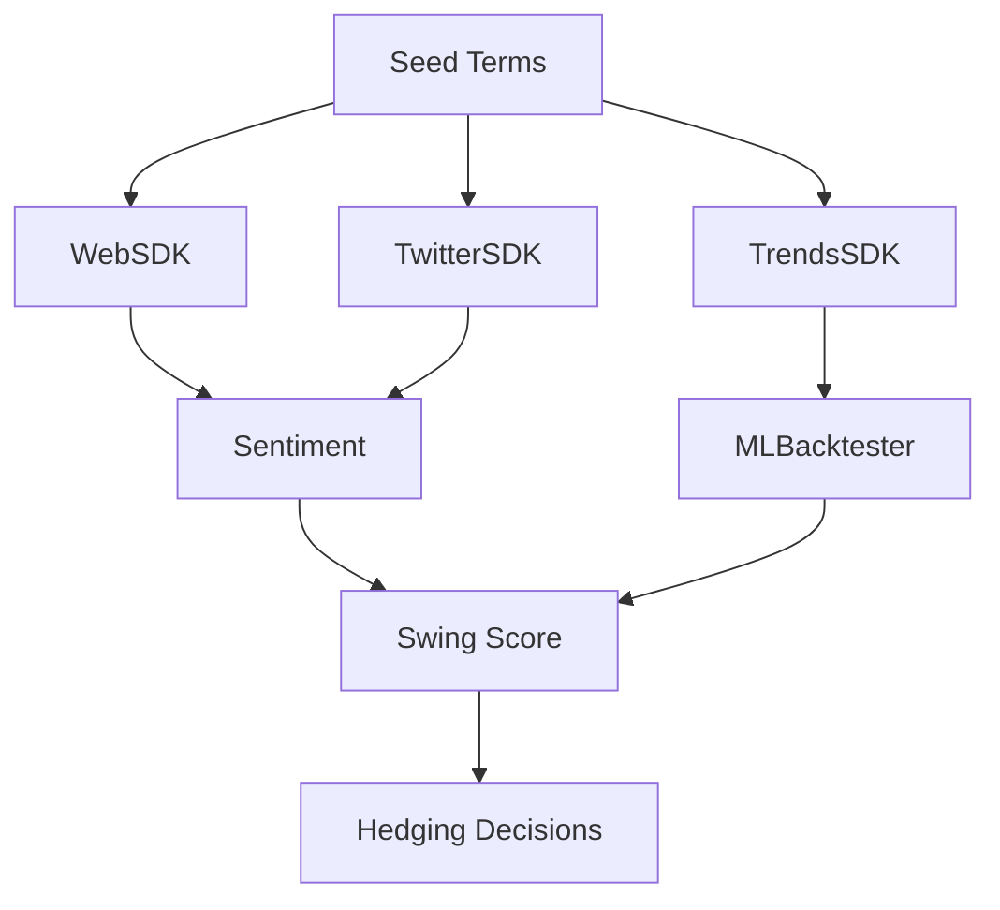

# MasterPlan: Crypto Swing Analysis Suite

## Vision and Overview

This document outlines a comprehensive suite of tools designed to analyze cryptocurrency market swings (focusing on BTC and ETH) and determine if they are sustained (fundamental-driven) or volatile/hype-based. The core output is a "swing sustainability score" (0-1) that informs hedging decisions: high score → light hedge (ride the trend); low score → heavy hedge (expect reversal).

The suite evolves your existing `data-mining-sdk` into a modular ecosystem, emphasizing idempotency, testability, and extensibility. It's built for your team to integrate into market-making workflows, triggering on position thresholds for real-time insights.

Key use case: During a BTC rally, the system pulls web sentiment, Twitter buzz, trends data, runs LLM reasoning and ML correlations, then scores: "0.8 sustained – institutional buying detected; hedge lightly."

## Ideation and Reasoning

### Genesis
Born from your old 'word multiplier' repo (misnamed data-mining), this expands into a full SDK ecosystem. The insight: Crypto swings aren't random—correlating web/social/trends data with prices can predict sustainability. We ideate a pipeline where:
- **Ingestion** repos fetch diverse signals.
- **Analysis** repos reason and model.
- Everything is async, resilient, and pipeline-friendly for low-latency decisions.

### Why This Structure?
- **Modularity (Reasoning)**: Separate repos allow independent development/testing (e.g., update Twitter without touching ML). Critique: Could lead to integration overhead—mitigated by shared schemas (Pydantic).
- **Focus on Crypto (Reasoning)**: Tailored for BTC/ETH; features like trends-price correlation directly address hedging. Critique: Narrow scope limits generality—expand later if needed.
- **AI/ML Hybrid (Reasoning)**: LLMs for qualitative reasoning ("hype vs. real"); XGBoost for quantitative backtesting. Critique: LLMs are costly/non-deterministic—use caching and fallbacks to rules-based logic.
- **Risk-Aware (Reasoning)**: Built-in proxies, fallbacks to handle scraping limits. Critique: Legal risks (e.g., TOS violations)—stick to public APIs where possible; document compliance.

### Critiques and Potential Weaknesses
- **Data Quality**: Scraping can be noisy/unreliable (e.g., Google CAPTCHA). Critique: Over-reliance could skew scores—mitigate with multi-source validation and error thresholds.
- **Overfitting in ML**: Models might fit history but fail live. Critique: Address with robust backtesting, cross-validation, and real-time monitoring.
- **Cost**: LLM APIs and proxies add expenses. Critique: Optimize with free tiers, caching, and batching.
- **Latency**: Full pipeline might exceed 5s for real-time hedging. Critique: Profile and parallelize; use caching for repeated queries.
- **Ethical/Legal**: Scraping paywalls or Twitter could violate terms. Critique: Use official APIs; add disclaimers and opt for ethical alternatives (e.g., NewsAPI instead of direct scraping).
- **Scalability**: High-throughput needs (e.g., 100s of terms) could overwhelm. Critique: Design with async/queues; test under load.
- **Maintainability**: Multi-repo setup increases overhead. Critique: Use monorepo if integration proves painful; automate with CI/CD.

Overall Strength: This is pragmatic, building on your existing code for quick wins while scaling to a full system.

## Deep Dive Research [Placeholder]

*(To be filled in next prompt: Compile online resources, benchmarks, case studies on similar systems (e.g., sentiment-based trading bots), data sources (e.g., best proxies for Trends), and critiques from quant forums like Quantopian/Reddit. Include stats like "BERT sentiment accuracy on financial text: ~85% per arXiv papers".)*

## Detailed Repo Breakdown

1. **Web Searching SDK (`web-search-sdk`)**
   - Features: Async searches (Google, news), term expansion, full-article parsing (text/links/summaries), headless browsing (Playwright for Bloomberg/CNBC), proxy rotation.
   - Tech: httpx, BeautifulSoup, Playwright, Pydantic schemas.
   - Integration: Outputs JSON to sentiment pipeline.

2. **Twitter SDK (`twitter-sdk`)**
   - Features: Read/write (posts/comments/likes/media), virality detection, sentiment extraction.
   - Tech: Tweepy/async wrappers, proxy rotation.
   - Integration: Feeds threaded data to sentiment.

3. **Sentiment Pipeline (`sentiment-pipeline`)**
   - Features: LLM chain-of-thought (e.g., GPT-4 for "hype analysis"), BERT for entities/sentiment.
   - Tech: LangChain/OpenAI API, Transformers.
   - Integration: Orchestrates ingestion; outputs scores.

4. **ML Backtester (`ml-backtester`)**
   - Features: XGBoost/NN modeling, feature engineering (trends vs. price), backtests on historical swings.
   - Tech: XGBoost, PyTorch, Pandas, Backtrader.
   - Integration: Trains models for sentiment; validates pipeline.

5. **Trends SDK (`trends-sdk`)**
   - Features: High-throughput queries, normalization, correlation with prices.
   - Tech: Custom async client, proxies.
   - Integration: Deprecate from web SDK; feed to ML.

## Overall Architecture

Flow: Parallel ingestion → Analysis → Scoring → Action.

## Implementation Phases

- **Phase 1 (1-2w)**: Web SDK (this repo)—expand as per TODO.
- **Phase 2 (2-3w)**: Twitter + Trends SDKs.
- **Phase 3 (3-4w)**: Sentiment + ML.
- **Phase 4 (2w)**: Integrate, test, deploy (e.g., AWS Lambda).

## Conclusion and Next Steps
Iterate via batches; start with the TODO list for this repo. Push after each for review. 