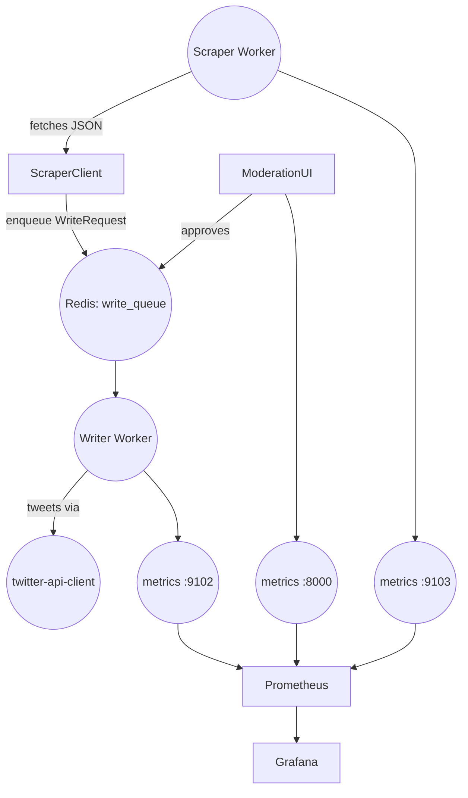

# Twitter-Stack – Wiring & API Reference
_Last updated: 2025-07-14_

## 1 Bird’s-eye view



All components are **Python packages under `src/`** and communicate via:

* Redis list `write_queue`
* HTTP (FastAPI or Twitter REST)
* Prometheus metrics scraped by the stack in `infra/`

---

## 2 Shared Core (`src/core`)

| Function / Class | Signature | Returns | Notes |
|------------------|-----------|---------|-------|
| `Settings` | _Pydantic BaseSettings_ (see table below) | object | Singleton instance exposed as `core.config.settings`. |
| `logger` | `structlog.BoundLogger` | - | Pretty Rich console in dev, JSON in prod. |
| `load_dotenv` | `(dotenv_path: str \| Path \| None = None, override=False)` | `None` | Tiny `.env` loader (avoids extra dep). |
| `get_secret` | `(name: str, *, default: str \| None = None)` | `str \| None` | env → AWS Secrets Manager → default. |

### 2.1  Selected `Settings` fields

| Field | Type | Default | Purpose |
|-------|------|---------|---------|
| `env` | `str` | `"dev"` | `"prod"` switches logging/metrics. |
| `redis_url` | `str` | `"redis://redis:6379/0"` | Used by writer & moderation-ui. |
| `cookie_path` / `proxy_file` | `Path` | `/opt/…` | Consumed by Scraper. |
| `api_host` / `api_port` | `str` / `int` | `0.0.0.0` / 8000 | Moderation-UI FastAPI. |
| `minio_*`, `aws_*` | misc | – | Storage / Secrets. |

---

## 3 Scraper Service (`src/services/scraper`)  

### 3.1  `ScraperClient`

| Method | Signature | Yields | Metrics |
|--------|-----------|--------|---------|
| `__init__(cookies_path: str \| None = None)` | – | – | loads cookies lazily. |
| `async get_tweets(ids: List[str])` | `List[Mapping[str, Any]]` (raw tweet JSON) | `tweets_fetched_total` Counter. |

Example:

```python
from services.scraper import ScraperClient
client = ScraperClient("/opt/cookies.json")
tweets = await client.get_tweets(["1770123456789"])
```

### 3.2  Worker entrypoint `worker.py`

```bash
poetry run python -m services.scraper.worker
```

• Starts Prometheus server on `:9103`  
• Placeholder loop until Dagster/cron orchestrates jobs.

---

## 4 Writer Service (`src/services/writer`)

### 4.1  Data model `models.py`

```text
WriteAction      = Enum("tweet", "dm", "delete")
ModerationStatus = Enum("pending", "approved", "rejected", "executed", "failed")

@dataclass
class WriteRequest:
    action: WriteAction
    payload: Mapping[str, Any]
    created_at: datetime = utcnow()
    moderation: ModerationStatus = PENDING
    def to_dict() -> MutableMapping[str, Any]
```

A JSON-encoded `WriteRequest.to_dict()` is pushed to Redis by Moderation-UI.

### 4.2  `WriterClient`

| Method | Purpose | Returns |
|--------|---------|---------|
| `ping()` | GET `/2/openapi.json` – health check | `bool` |
| `tweet(text: str, **params)` | Posts tweet; retry w/ exp backoff on 401/429 | JSON dict from Twitter |
| `dm(recipient_id: str, text: str, **params)` | ⚠ Planned | — |

### 4.3  Worker loop `worker.py`

* Blocking `BLPOP` from `write_queue`
* Calls `_process_request()` → `WriterClient.tweet`
* Metrics  
  - `writer_actions_processed_total{action}` Counter  
  - `writer_worker_backoff_seconds` Gauge  
* Exposes metrics on `:9102`

Run locally:

```bash
poetry run python -m services.writer.worker
```

---

## 5 Moderation-UI (`src/apps/moderation_ui/app`)  *(high-level)*

Component | Path | Key Callables
----------|------|--------------
FastAPI factory | `main.get_application()` | Returns fully wired `FastAPI` app.
Health check | `health.router` | `GET /healthz` → `{"status": "ok"}`
Pagination util | `core.pagination.paginate(queryset, params)` → `Page` pydantic model
Auth router | `core.auth.get_auth_router()` | JWT endpoints (stubbed)
User CRUD | `users.manager` + `users.routes`

The app registers **Prometheus FastAPI Instrumentator** → `/metrics` on same port (8000).  
Database layer uses Tortoise ORM (still being typed).

---

## 6 Metrics Endpoints

Service | Port | Path
--------|------|-----
Moderation-UI | `${api_port}` (8000) | `/metrics`
Writer Worker | 9102 | Prom‐http
Scraper Worker | 9103 | Prom‐http

Add each to `prometheus.yml` scrape-configs (already done for writer & mod-ui).

---

## 7 Planned / Stubs

| Module | Status | ETA / Notes |
|--------|--------|-------------|
| `src/services/cookie_sentinel` | empty pkg | Will replace with sentinel fork for cookie rotation. |
| `WriterClient.dm` / DELETE | `NotImplementedError` | Await Twitter SDK v2 DM support. |
| Dagster ingestion jobs | cancelled (wheel compat) | Re-enable once Python 3.13 wheels land. |
| Moderation-UI MyPy strict | 14 errors left | Tracked in TODO `refactor_moderation_ui_core`. |

---

## 8 Quick-start Code Snippets

### Enqueue a tweet from another repo

```python
import json, redis
from services.writer.models import WriteAction, WriteRequest

redis_client = redis.from_url("redis://redis:6379/0")
rc = WriteRequest(action=WriteAction.TWEET, payload={"text": "hello world"})
redis_client.rpush("write_queue", json.dumps(rc.to_dict()))
```

### Reading secrets

```python
from core.secrets import get_secret, load_dotenv
load_dotenv()                     # local dev only
token = get_secret("TWITTER_TOKEN")
```

---

## 9 Conventions

1. **All public helpers are synchronous** except `ScraperClient.get_tweets` – keeps non-async repos usable.  
2. **Structured logs**: always call with keyword params → appear as JSON fields in prod.  
3. **Enums + dataclasses** preferred over bare dicts to keep queues self-documenting.  
4. Missing optional deps (`twscrape`, `twitter_api_client`, `prometheus_client`) are stubbed so `mypy --strict` stays green.

---

Happy hacking!  
Ping `@gregb` or open a discussion if any behaviour here drifts from implementation.